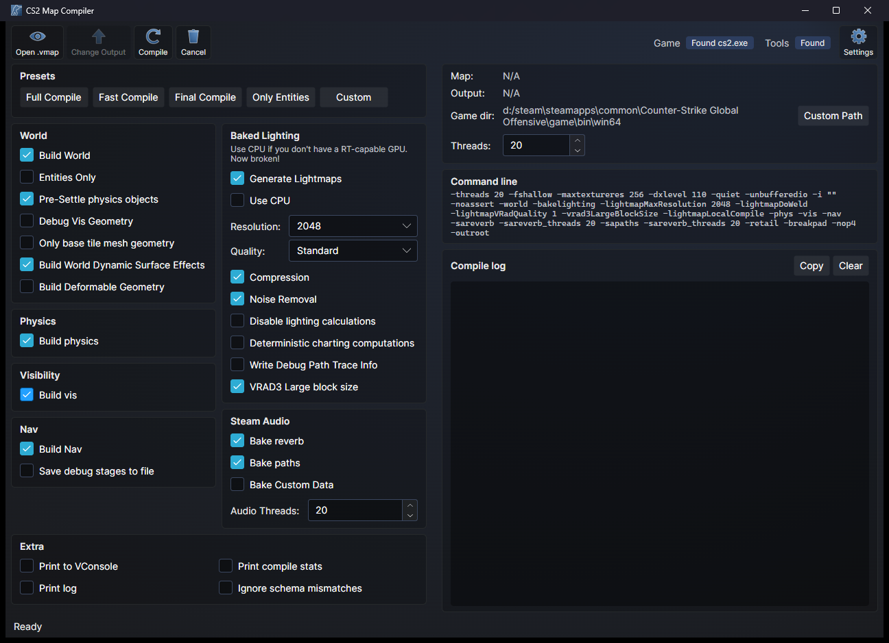

# CS2 Map Compiler
A GUI for resourcecompiler with the same options as Hammer for compiling maps, plus more.

# Requirements
- Any Source 2 game and Workshop Tools installed. (If the application cannot find the game, click Custom Path and select the game's exe.)

# Usage

1. Open your .vmap file (or a .txt map list).
2. Select the desired options, or start from one of the presets.
3. Click Compile. Everything resourcecompiler prints shows up in the compile log.

Hover over any option to see what it does in the bar at the bottom. The theme and the accent color behind the window gradient can be changed in Settings.

When lightmaps are baked on the GPU, a Lightmap Preview window opens as soon as resourcecompiler writes vrad3's script into the addon's `_vrad3` folder, with the lightmap's blocks laid out.
Each block is shown as vrad3 finishes baking it, read from vrad3's memory without changing anything in it, so the bake is not slowed and the compile can not be affected.

